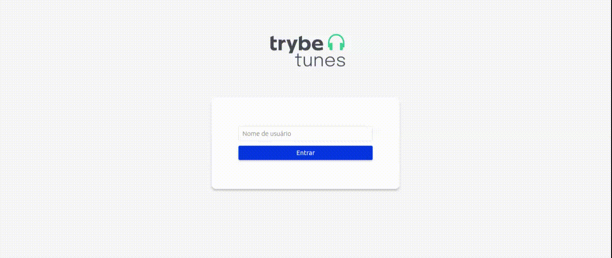

<h1 align="center">
  :headphones: TrybeTunes :notes:
</h1>

&emsp;

## Sobre o projeto

***Projeto realizado durante módulo de Frontend na Trybe, entre 07 e 20 de Março de 2022.***

O Trybetunes é uma aplicação capaz de reproduzir músicas das mais variadas bandas e artistas, criar uma lista de músicas favoritas e editar o perfil da pessoa usuária logada.

  

Essa aplicação foi feita em [React](https://pt-br.reactjs.org/docs/getting-started.html) utilizando o conjunto de ferramentas [Create React App](https://pt-br.reactjs.org/docs/create-a-new-react-app.html) e o [React Router](https://v5.reactrouter.com/) para navegação entre as rotas.

A pasta src/services, as imagens da logo e as configurações do linter foram fornecidos pela equipe da [Trybe](https://www.betrybe.com/), escola de programação onde eu realizei este projeto, o restante foi desenvolvido por mim.

> Acesse a página do projeto em https://leticia-238.github.io/trybetunes/

## Instruções para a instalação

### Pré-requisitos para iniciar a aplicação no computador:

- git
- node 16

### Execute os seguintes passos no terminal:

1. Clone o projeto: `git clone git@github.com:leticia-238/trybetunes.git`

2. Entre na pasta do repositório clonado: `cd trybetunes`

3. Instale as dependências: `npm install`

4. Inicialize a aplicação no navegador: `npm start` (abre uma nova página em http://localhost:3000/trybetunes)
